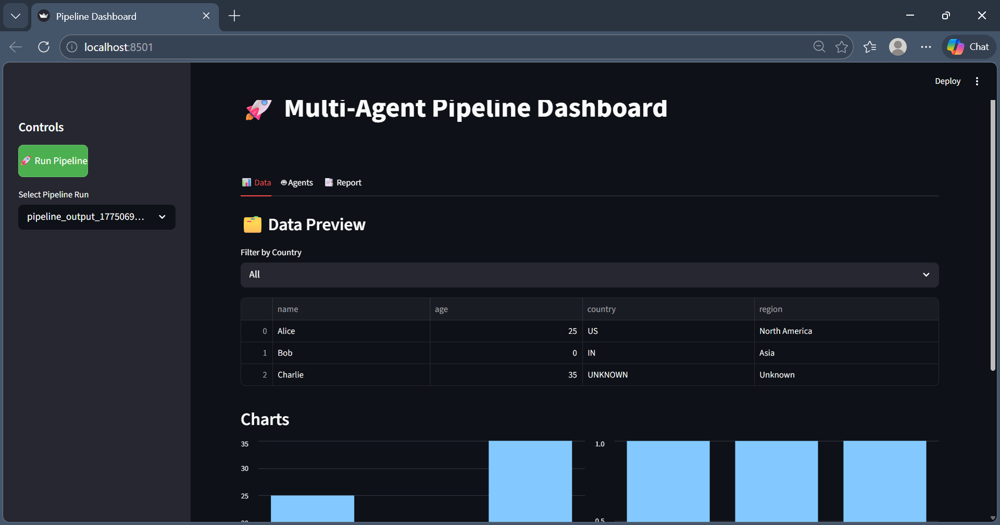

# Multi-Agent Pipeline Project

A modular, plug-and-play **Python workflow pipeline** with multi-agent decision layers, AI/LLM-ready architecture, and modern monitoring capabilities.

---

## Features

- Modular processes:
  - `fetch` – deterministic data retrieval
  - `clean` – basic and advanced cleaning
  - `transform` – basic and advanced transformations
  - `report` – multiple reporting styles
- Multi-agent system:
  - **Cleaning Agent**
  - **Transformation Agent**
  - **Reporting Agent**
- Fully **runnable without AI**, but can plug in LLMs later
- Async / parallel execution ready
- FastAPI endpoint to trigger the pipeline
- Streamlit dashboard for monitoring and live pipeline runs
- Auto-saving pipeline outputs with history tracking

---

## Project Structure
```
workflow_project/
│
├── processes/
│   ├── fetch.py
│   ├── clean.py
│   ├── transform.py
│   └── report.py
│
├── agents/
│   ├── base.py
│   ├── cleaning_agent.py
│   ├── transformation_agent.py
│   └── reporting_agent.py
│
├── orchestrator/
│   └── pipeline.py
│
├── ui/
│   └── dashboard_with_api.py
│
├── main.py
├── config.py
├── utils.py
├── requirements.txt
└── outputs/
```

---

## Installation

### 1. Clone the repo:

```bash
git clone https://github.com/Tarak-Chandra-Sarkar/workflow_project.git
cd workflow_project
```

### 2. Create a virtual environment:
```bash
python -m venv venv
source venv/bin/activate  # Linux / macOS
venv\Scripts\activate     # Windows
```

### 3. Create a virtual environment:
```bash
pip install -r requirements.txt
```

## Usage
### Run pipeline via script
```bash
python main.py
```
Outputs are saved automatically in outputs/.

### Run pipeline via API
```bash
uvicorn api_service:app --reload
```
### Access API endpoint:
```bash
GET http://127.0.0.1:8000/run
```
### Launch Streamlit Dashboard
```bash
streamlit run ui/dashboard_with_api.py
```

## Features:

- Trigger pipeline
- Live view of latest outputs
- Tabs: Data / Agents / Report
- Colored badges for fallback decisions
- Interactive filtering by agent or country

### Extending the Pipeline
- Replace agent logic with AI/LLM models
- Enable async / parallel execution
- Add new processes or reports
- Integrate with UI dashboards or monitoring services

## Requirements
- Python 3.9+
- FastAPI
- Uvicorn
- Streamlit
- Requests

## Demo Screenshots
